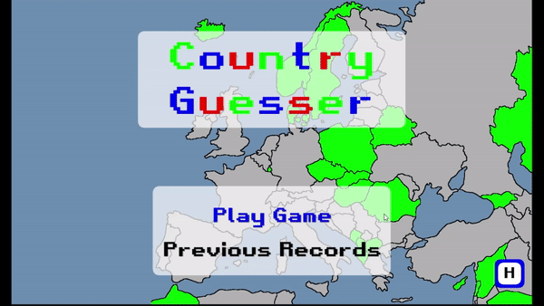

# Welcome to my Country Guesser Game! :earth_americas:
## :bookmark_tabs: Table of Contents

- **:question: [Why this Project?](#question-why-this-project)**

- **:earth_americas: [How to Play](#earth_americas-how-to-play)**
  - **:world_map: [Map](#world_map-map)**
  - **:electric_plug: [Controls](#electric_plug-controls)**
  - **:dart: [Main Menu](#dart-main-menu)**
  - **:gem: [Game Basics](#gem-game-basics)**
  - **:globe_with_meridians: [Playing the Game](#globe_with_meridians-playing-the-game)**
  - **:white_check_mark: [Correctly Guessing a Country](#white_check_mark-correctly-guessing-a-country)**
  - **:no_entry: [Incorrectly Guessing a Country](#no_entry-incorrectly-guessing-a-country)**
  - **:bulb: [Hints](#bulb-hints)**
  - **:heart: [Losing a Life](#heart-losing-a-life)**
  - **:hourglass: [Timer](#hourglass-timer)**
  - **:trophy: [Winning the Game](#trophy-winning-the-game)**
  - **:x: [Losing the Game](#x-losing-the-game)**
  - **:file_folder: [Previous Records](#file_folder-previous-records)**
- **:video_game: [Play the Game](#video_game-play-the-game)**
- **:open_file_folder: [Languages, Frameworks/Libraries, and Tools](#open_file_folder-languages-frameworkslibraries-and-tools)**
## :question: Why this Project?

This project was created as part of a final project for my Game Programming course in my second to last semester of Computer Science at John Abbott College. The **goal of the game** is to correctly guess all the countries on the map! The idea of the game came to light when I decided it would be the most fun experience to combine my **passions** of **coding** and **travel/geography** into a unique and simple game to test and expand your geographical knowledge of these countries. 

## :earth_americas: How to Play

### :world_map: Map

The game consists of a map of countries in Europe, and small parts of Asia, Middle East, and North Africa.

*\* **Don't look at the countries below if you don't want to see the countries before playing the [game](https://braedengiasson.github.io/BraedensCountryGuesser.github.io/)!** \**

#### European Countries
Albania, Andorra, Austria, Belarus, Belgium, Bosnia and Herzegovina, Bulgaria, Croatia, Czech Republic, Denmark, Estonia, Faroe Islands, Finland, France, Germany, Greece, Hungary, Iceland, Ireland, Italy, Kosovo, Latvia, Liechtenstein, Lithuania, Luxembourg, Moldova, Montenegro, Netherlands, North Macedonia, Norway, Poland, Portugal, Romania, Serbia, Slovakia, Slovenia, Spain, Sweden, Switzerland, U.K., Ukraine, Åland Islands.

#### Asian Countries
Armenia, Azerbaijan, Georgia, Kazakhstan, Russia.

#### Middle Eastern Countries

Cyprus, Iran, Iraq, Israel, Jordan, Lebanon, Palestine, Saudi Arabia, Syria, Turkey.

#### North African Countries

Algeria, Morocco, Tunisia.

### :electric_plug: Controls

#### W or Up Arrow

Press the '**W**' or '**Up Arrow :arrow_up:**' key on your keyboard to move your selection up. 

#### S or Down Arrow

Press the '**S**' or '**Down Arrow :arrow_down:**' key on your keyboard to move your selection down. 

#### Enter

Press the '**Enter**' key on your keyboard to choose the current selection or continue. 

#### H

Press the '**H**' key on your keyboard to get help on how the game works, how to play, and to use a hint. 

### :dart: Main Menu

The game starts on the menu screen with 3 options, '**Play Game**', '**Previous Records**', '**H**'.

Press the '**H**' key your keyboard (while in the main menu), to get help on how to play the game.

Press '**Enter**' on your keyboard while selecting the '**[Previous Records](#file_folder-previous-records)**' option to view your top **10** previous scores and time taken.    

Finally, to play the game, press '**Enter**' on your keyboard while selecting the '**Play Game**' option to embark on the exciting and addicting feeling of playing the game!
### :gem: Game Basics

When starting the game, you will be greeted with a message letting you know to enjoy the game, press '**Enter**' on your keyboard to continue to the game.

Then, you will be greeted with the **game map** on the right hand side of the screen. On the left hand side, there are 2 panels. 

The upper small panel, holds the **game information**. This includes the number of **lives**, the number of **hints**, the amount of **correctly guessed countries**, and the game **timer**. 

The lower small panel, holds the **guess options**. This includes the **4 country guess options** the user has to guess from correctly.
### :globe_with_meridians: Playing the Game

Finally, you now know the :electric_plug: **controls**, and the :gem: **game basics**, you're ready to start playing!

To start, you'll see the **map** with all countries colored in :white_circle: **white**, these are the countries that haven't yet been guessed. 

You'll also see a country colored in :large_blue_circle: **blue**, this is the country name you need to guess. On the left hand side of the screen, you'll see the country name options to guess from, you need to **correctly** guess the country that associates with the country in :large_blue_circle: **blue**. 

Once you guess a country, you will find out if you :white_check_mark: [**correctly guessed the country**](#white_check_mark-correctly-guessing-a-country) or if you :no_entry: [**incorrectly guessed the country**](#no_entry-incorrectly-guessing-a-country). 

You will **repeat** this process of guessing the country in :large_blue_circle: **blue** until you've finished the game!

If you're unsure of where or what the country it is, you can use a :bulb: **[hint](#bulb-hints)** to help you out. Watch out, you only have **10 hints** during the game!

If you **incorrectly** guess the country **3 turns** in a row, you'll sadly :heart: **[lose a life](#heart-losing-a-life)**. If you lose all 3 of your lives, the game will **end**, and you'll be a loser, so a pro tip, try not to do that!

You :trophy: **[win the game](#trophy-winning-the-game)** if you correctly guess all **60** countries on the map! 

You :x: **[lose the game](#x-losing-the-game)** if you lose all **3** of your **lives**, or if you **don't correctly** guess all 60 countries on  the map...

Well, that's all! This is a **fun**, **interactive**, and **brain challenging** game to **test and expand** your **geographical** **knowledge** of the world. I hope you have **fun**, and :star: **good luck**!

### :white_check_mark: Correctly Guessing a Country

When you **correctly** guess the country, a variety of things will happen. One of the first things you will notice is the **country color** on the map will turn from :large_blue_circle: **blue** to :green_apple: **green**, and the **country name** in the guess list will be filled :green_apple: **green**.

You will also notice a :page_facing_up: **text block** appear on the screen with a message indicating your success on the correct guess! 

Lastly, you will notice in the **game information** panel, the number of correct country guesses out of 60 will have gone **up by 1**. 

To **end the turn**, press the '**Enter**' key on your keyboard to move onto the **next country** to guess.

### :no_entry: Incorrectly Guessing a Country

When you **incorrectly** guess the country, a variety of things will happen. One of the first things you will notice is the **country color** on the map will turn from :large_blue_circle: **blue** to :red_circle: **red**, the **guessed country name** in the guess list will be filled :red_circle: **red**, and the **correct country name** in the guess list will be outlined in :green_apple: **green**.

You will also notice a :page_facing_up: **text block** appear on the screen with a message indicating you guessed the **wrong country**, what the **correct country name** was, and a small **information message**.

If you incorrectly guessed the country for the :three: **third time in a row**, you will :heart: **[lose a life](#heart-losing-a-life)** in the **game information** panel. Don't lose all **3** lives, or else you lose... 

To **end the turn**, press the '**Enter**' key on your keyboard to move onto the **next country** to guess.

### :bulb: Hints

During the game, you might have **no idea** what the name of the country to guess is, or, it might be **too small on the map** to properly see, you will need a **hint** to **help** figure out what the country name is.

To **use a hint**, you simply have to press on the '**H**' key on your keyboard, which will display a **message hint at the top of the screen**. You can only use **1** hint per turn, so this message will remain on the screen for **only 7 seconds**, so use it fast!

Once you use a hint during a turn, you will notice the **number of hints decrease by 1** in the **game information** panel.

Be mindful, you can only use a **total of 10 hints** throughout the game, use them **carefully**...

### :heart: Losing a Life

During the game, you might end up losing a life, you don't want that...

You **start** the game off with **3 lives**. You **lose a life** when you **incorrectly guess the country 3 times in a row**. You will visually see this loss in the **game information** panel, with **a heart** turning from :red_circle: **red** to :white_circle: **white**. 

If you **lose** all **3 lives**, you will :x: [**lose the game**](#x-losing-the-game).

### :hourglass: Timer

The timer is used to track **how much time** it takes you to **finish** the game. It's only purpose is to challenge you to win the game in at **least time** as possible! If the timer distracts you, don't worry about it, focus on **correctly guessing** all the countries (try not to get one wrong!). The timer is also used in the '**[Previous Records](#file_folder-previous-records)**' screen, showing on how much time it took you in that specific game.

### :trophy: Winning the Game

Hooray :tada:, you **won** the game!! **Congrats** on correctly guessing all countries, that's **impressive**!

If you win the game, the **game will stop**, and you will see the screen displayed with a **message indicating you won**, a **congratulatory message**, the **time taken** during the game, and the **correct amount of countries guessed** out of the total (**60**).

You will have the option to '**Play Again**' to hop into a new game, or go to the main menu by selecting the '**Main menu**' option.

### :x: Losing the Game

Losing the game entails that you are a **loser**, and you don't want that now do you?

If you lose the game, the **game will stop**, and you will see the screen displayed with a **message indicating you lost**, the **time taken** during the game, and the **correct amount of countries guessed** out of the total (**60**).

You will have the option to '**Play Again**' to hop into a new game, or go to the main menu by selecting the '**Main menu**' option.
### :file_folder: Previous Records

The previous records screen shows your all-time **top 10 scores**!

The **first column** displays the **index** of the table for each row.

The **second column** displays the **correct amount of countries** guessed out of the total (**60**) for each row.

The **third column** displays the **time taken** during the game for each row.

Press the '**Escape**' key on your keyboard to go back to the **main menu**.

## :video_game: Play the Game

### * Play my exciting and interactive game [here](https://braedengiasson.github.io/BraedensCountryGuesser.github.io/)! *

## :open_file_folder: Languages, Frameworks/Libraries, and Tools

	
        &nbsp;
    
        &nbsp;
    
        &nbsp;
    
        &nbsp;
    
        &nbsp;
    
        &nbsp;

